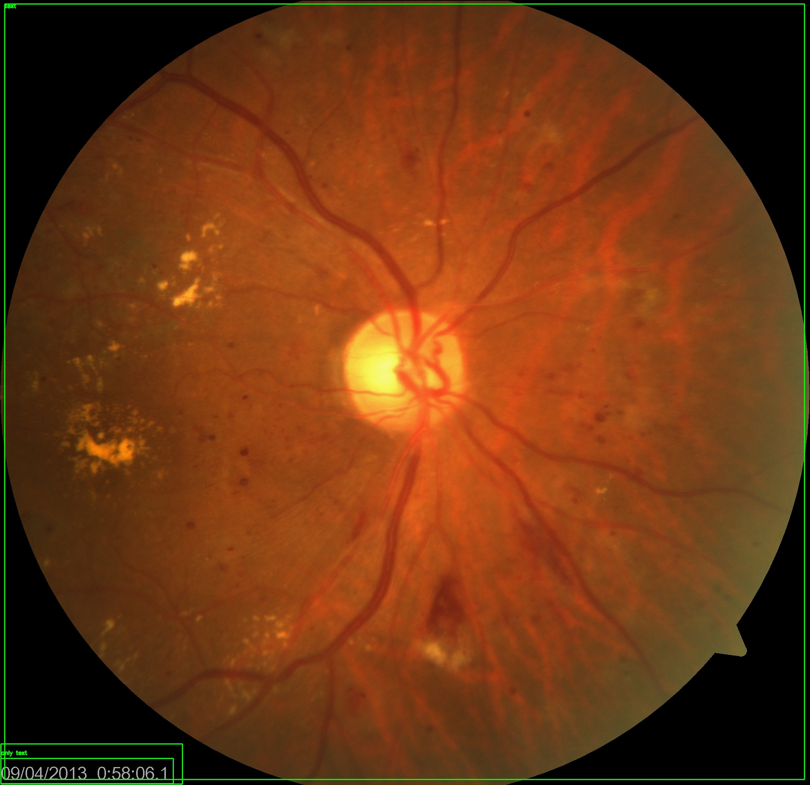
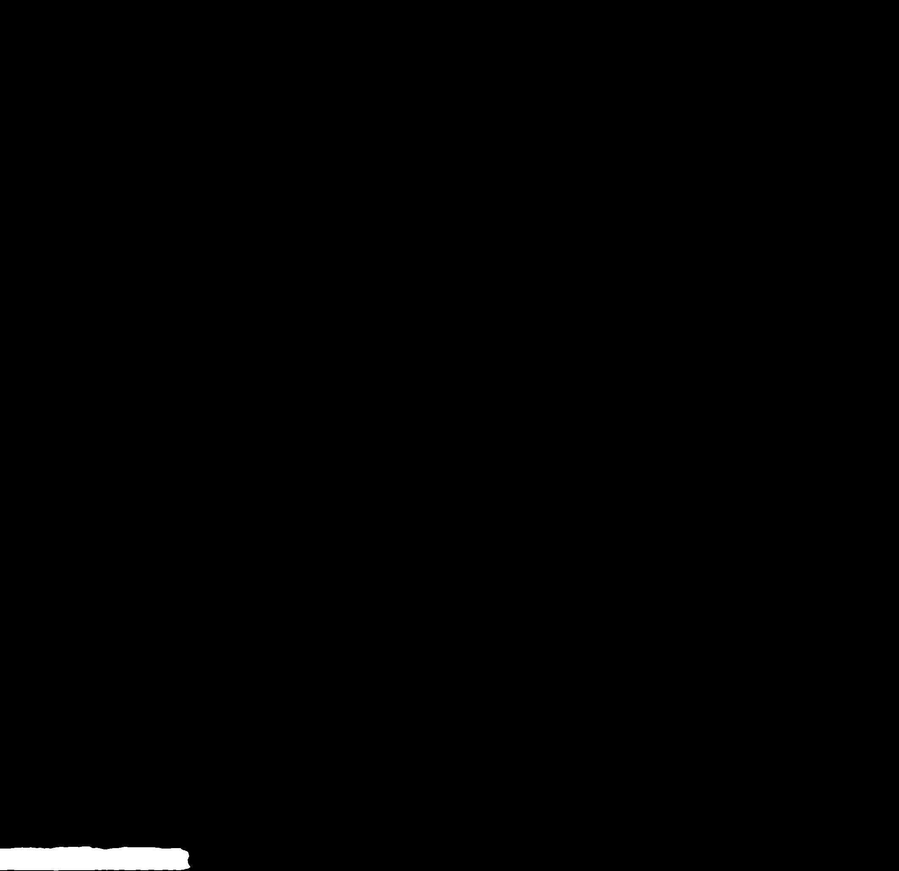
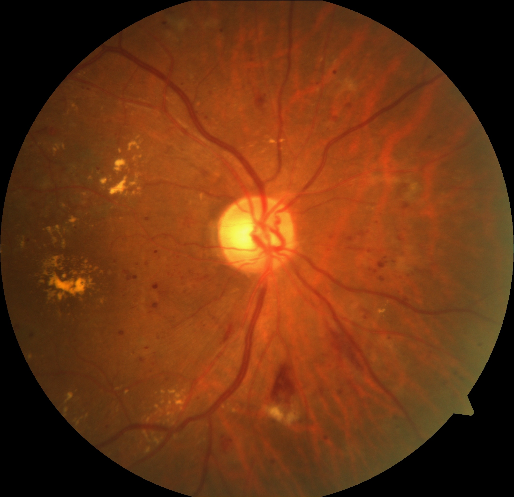

# Using GroundingDINO + SAM for Automated Image Preprocessing
[](https://colab.research.google.com/github/saadwazir/grounding_dino_and_sam_automated_dataset_annotation_and_evaluation/blob/main/grounding_dino_and_sam_automated_dataset_annotation_and_evaluation.ipynb)


### *Step-by-Step Toy Example*

Removing sensitive text like dates, timestamps, and unwanted overlays from images can be tedious when processed manually. This demonstrates a complete image-preprocessing pipeline using:

- **GroundingDINO** → Open-vocabulary object detection
- **Segment Anything (SAM)** → Pixel-accurate segmentation masks
- **Custom scripts** → Filtering, mask processing, and automated image cleaning

This project is intentionally designed as a **toy example** simple, explainable, and easy to extend. The goal is to help you understand how to set up GroundingDINO + SAM locally and use them for real-world preprocessing tasks.

---

# 1. Folder Overview

Below is the full structure of the repository:

```
grounding_dino_and_sam/
│
├── data/
├── GroundingDINO/
├── output-dino/
│   ├── annotations/
│   └── voc_annotations/
├── output-filter/
│   ├── filtered_images/
│   └── filtered_voc/
├── output-removed/
├── output-sam/
│
├── class-dino.py
├── prompt-dino.py
├── filter.py
├── sam.py
├── apply_masks_to_images.py
└── sam_vit_h_4b8939.pth
```

---

# 2. Setup Instructions

## 2.1 Install CUDA (Recommended for GPU Users)
To enable fast inference:

```bash
nvidia-smi
```
Ensure CUDA 11.8+ and updated NVIDIA drivers.

---

## 2.2 Create Python Environment

```bash
conda create -n dino_sam python=3.10 -y
conda activate dino_sam
```

---

## 2.3 Install PyTorch with CUDA

```bash
pip install torch torchvision --index-url https://download.pytorch.org/whl/cu118
```

---

## 2.4 Install GroundingDINO

```bash
git clone https://github.com/IDEA-Research/GroundingDINO.git
cd GroundingDINO
pip install -r requirements.txt
pip install -e .
cd ..
```

---

## 2.5 Install Segment Anything (SAM)

Download checkpoint:

```
sam_vit_h_4b8939.pth
```

Install library:

```bash
pip install git+https://github.com/facebookresearch/segment-anything.git
```

---

# 3. Dataset (Toy Example)

Inside the repository:

```
/data
```

Each image contains a **timestamp in the lower-right corner**. Our task is to remove it using automated AI preprocessing.

Example:


---

# 4. Step 1 — Detect Text Using GroundingDINO

For this tutorial, we use **prompt-dino.py**, which supports natural language prompts. Example:

```python
TEXT_PROMPT = "only text on lower right corner"
```

Run detection:

```bash
python prompt-dino.py
```

---

## 4.1 Output

### ✔️ Annotated images (sanity check)
Saved in:

```
output-dino/annotations/
```

Example:



---

### ✔️ Pascal VOC XML annotations
Saved in:

```
output-dino/voc_annotations/
```

These XML files contain bounding box coordinates and will be used in the next steps.

Example snippet:

```xml
<object>
    <name>text</name>
    <bndbox>
        <xmin>123</xmin>
        <ymin>456</ymin>
        <xmax>789</xmax>
        <ymax>900</ymax>
    </bndbox>
</object>
```

---

# 5. Step 2 — Filter Bounding Boxes

Not all detections are valid. Some are:

- Too large
- Too tall/narrow
- Square (not typical for text)
- Irrelevant depending on your dataset

`filter.py` applies custom filtering rules.

Run:

```bash
python filter.py
```

---

## 5.1 Output

### ✔️ Filtered visualization images
```
output-filter/filtered_images/
```


---

### ✔️ Filtered XML annotations
```
output-filter/filtered_voc/
```

These will be used for SAM segmentation.

---

# 6. Step 3 — Generate Segmentation Masks with SAM

Using `sam.py`, SAM transforms each bounding box into a **pixel-perfect mask**.

Run:

```bash
python sam.py
```

This script:

- Interprets filtered bounding boxes
- Generates segmentation masks
- Keeps only the *largest connected component* (actual text region)
- Saves results in `output-sam/`

Example:



---

# 7. Step 4 — Remove the Text Using the Generated Masks

The script `apply_masks_to_images.py` applies SAM masks to the original images.

Run:

```bash
python apply_masks_to_images.py
```

This step:

- Loads original images
- Loads masks from `output-sam/`
- Removes (blackens) masked areas
- Saves cleaned images into:

```
output-removed/
```

Example:



A CSV log is also created:

```
output-removed/log_xx-xx-xxxx.csv
```

It contains:
- Pixel stats
- Bounding box sizes
- Percentage of removed pixels

---

# 8. Complete Pipeline Overview

```
/data → prompt-dino.py → output-dino/
        ↓
filter.py → output-filter/
        ↓
sam.py → output-sam/
        ↓
apply_masks_to_images.py → output-removed/
```

This is a **toy example**, but the workflow can be extended to:

- Remove watermarks
- Clean scanned documents
- Remove medical image labels
- Remove timestamps from CCTV or drone footage
- Open-vocabulary text removal (via prompts)

---

# 9. Google Colab

A Colab Notebook version of this project is available here:

Fixed:https://colab.research.google.com/github/saadwazir/grounding_dino_and_sam_automated_dataset_annotation_and_evaluation/blob/main/grounding_dino_and_sam_automated_dataset_annotation_and_evaluation.ipynb.

Original:https://colab.research.google.com/github/roboflow-ai/notebooks/blob/main/notebooks/automated-dataset-annotation-and-evaluation-with-grounding-dino-and-sam.ipynb

---

# 10. Final Notes

This repository demonstrates how GroundingDINO and SAM can work together for automated preprocessing. With only minor modifications, the pipeline can scale to large datasets and diverse tasks.

Feel free to clone, fork, and extend this project.

Happy experimenting!

